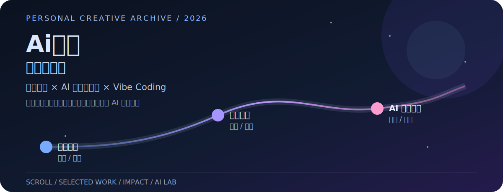
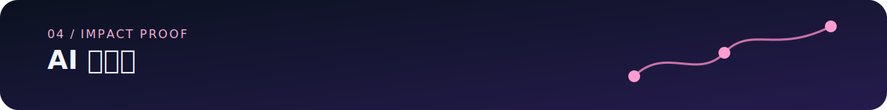
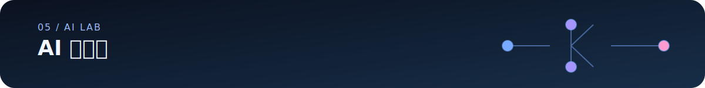

# Ai路人｜深空创作舱

<p align="center">
  
</p>

> 动态设计师的 AI 创作档案：把图像、视频、特效玩法和可复用的创意工作流，整理成一个可以直接浏览的单页作品集。

<p align="center">
  <a href="https://ai-luren.github.io/">在线浏览</a> ·
  <a href="https://ailuren.pages.dev/">国内访问</a> ·
  <a href="#本地运行">本地运行</a> ·
  <a href="./docs/交接说明.md">交接说明</a>
</p>

## 先看作品

这是一个以滚动叙事为主的个人作品集，不是传统的项目管理后台。页面把真实的创作路径拆成五个阶段：动态设计、产品品牌、特效玩法、AI 效果交付，以及持续探索中的 AI 工作流。

<table>
  <tr>
    <td width="25%"></td>
    <td width="25%"></td>
    <td width="25%"></td>
    <td width="25%"></td>
  </tr>
</table>

作品集中的影响力证据包括获奖作品、平台发布记录、AI 工具实践和工作经历；具体内容以站内展示和仓库内资源为准，不额外虚构数据或案例。

## 它是怎么做的

```text
原生 index.html
  ├─ 页面章节、背景视频、全局样式、滚动逻辑
  └─ React 19
       ├─ 精选创作档案
       ├─ AI 影响力证据
       ├─ AI 实验室
       └─ GSAP / WebGL 视觉交互
```

这个混合架构是有意保留的：页面入口和媒体叙事保持直接可读，React 只承载需要组件化的交互模块；GSAP 与 ScrollTrigger 通过 `vendor/` 和运行时降级逻辑加载，保证依赖失效时仍能看到基础内容。

## 在线地址

| 地址 | 用途 |
| --- | --- |
| [GitHub Pages](https://ai-luren.github.io/) | 主站入口；中国大陆网络可能无法直连 |
| [Cloudflare Pages](https://ailuren.pages.dev/) | 国内访问优先地址 |
| [Netlify](https://ailuren.netlify.app/) | 备用生产地址 |
| [Vercel](https://ailuren.vercel.app/) | 备用生产地址；中国大陆网络可能无法直连 |

四个平台使用同一套构建配置：生产分支为 `main`，构建命令为 `npm run build`，发布目录为 `dist/`。

## 本地运行

需要 Node.js 20 或 22。

```bash
git clone https://github.com/Ai-luren/Ai-luren.github.io.git
cd Ai-luren.github.io
npm ci
npm run dev
```

然后打开终端显示的本地地址，通常是 <http://127.0.0.1:5173/>。不要双击 `index.html` 或使用 `file://` 打开，因为视频、相对路径和 React 模块需要由 Vite 提供服务。

### 生产构建与检查

```bash
npm run build
npm run preview
git diff --check
```

`npm run build` 会生成临时的 `dist/`。它是部署产物，不直接编辑，也不提交到仓库。

<p align="center">
  
</p>

## 精选创作档案

精选作品的完整交互展示位于在线作品集；README 使用真实封面作为快速预览。

<p align="center">
  
</p>

## AI 影响力

页面中的获奖、平台发布和创作证据集中在 AI 影响力章节，具体以站内展示为准。

<p align="center">
  
</p>

## AI 实验室

这里放持续探索中的 AI 实验、Vibe Coding 尝试和可复用创意工作流。

## 目录速览

```text
.
├── assets/                 页面字体、图片、视频和 README 展示素材
├── docs/                   设计规范与交接说明
├── src/components/         作品档案、影响力和实验室组件
├── vendor/                 GSAP 与 ScrollTrigger 静态运行时
├── index.html              单页入口、章节、全局样式和媒体叙事
├── package.json            依赖与脚本
└── vite.config.js          Vite 构建配置
```

常见修改入口：

| 想改什么 | 主要文件 |
| --- | --- |
| 页面章节、首屏和页脚 | `index.html` |
| 精选创作档案 | `src/components/MagneticProjectArchive.jsx` |
| 获奖、平台和社交证据 | `src/components/ImpactEvidence.jsx` |
| AI 实验室卡片 | `src/components/ExperimentFlip.jsx` |
| Hero 标题和按钮 | `src/components/HeroTitle.jsx`、`src/components/HeroActions.jsx` |

开始维护前，请先阅读 [`AGENTS.md`](./AGENTS.md)、[`docs/设计规范.md`](./docs/设计规范.md) 和 [`docs/交接说明.md`](./docs/交接说明.md)。

## 部署约定

改动建议按这条链路进行：

```text
修改 → npm run build → git diff --check → Pull Request → 检查预览 → 合并 main → 自动部署
```

`main` 受保护，不建议直接推送。GitHub Pages 使用仓库内的 Actions 工作流构建并发布 `dist/`；Cloudflare Pages、Vercel 和 Netlify 使用各自的平台 Git 集成。

## 许可证

本项目以 [MIT License](./LICENSE) 发布。

Copyright (c) 2026 Ai路人

## 联系与作品

个人站点中的联系方式、社交平台和完整作品档案会随页面内容更新；优先从[在线作品集](https://ai-luren.github.io/)查看最新版本。
